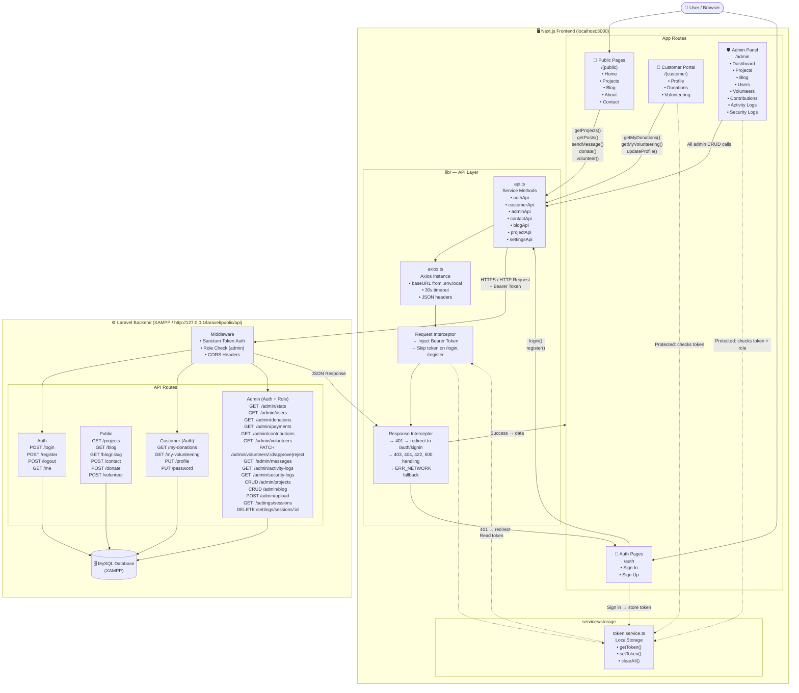
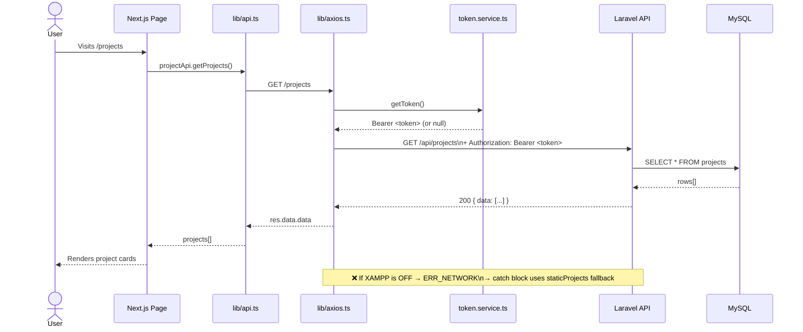
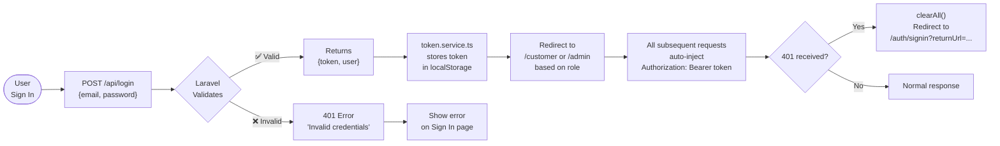

# GGNF System Flow Chart — Frontend ↔ Backend

## Architecture Overview

---

## Request Lifecycle (Step by Step)

---

## Authentication Flow

---

## Module Summary Table

| Layer | Location | Responsibility |
|-------|----------|----------------|
| **Pages (Public)** | `app/(public)/` | Home, Projects, Blog, About, Contact |
| **Pages (Auth)** | `app/auth/` | Sign In, Sign Up |
| **Pages (Customer)** | `app/(customer)/` | Donations, Volunteering, Profile |
| **Pages (Admin)** | `app/admin/` | Dashboard, CRUD for all resources |
| **API Services** | `lib/api.ts` | All typed API calls grouped by domain |
| **Axios Instance** | `lib/axios.ts` | Base URL, timeout, interceptors |
| **Token Service** | `services/storage/token.service.ts` | localStorage read/write/clear |
| **Static Fallbacks** | Inside page files | Used when backend is unreachable |
| **Laravel Backend** | `http://127.0.0.1/laravel/public/api` | REST API, Auth, CRUD, CORS |
| **Database** | MySQL via XAMPP | Persistent data storage |
